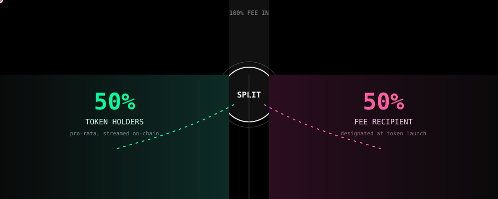
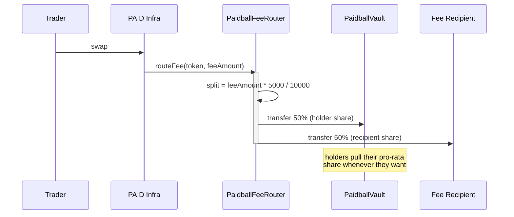
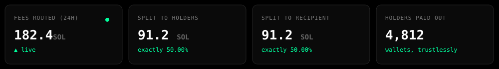
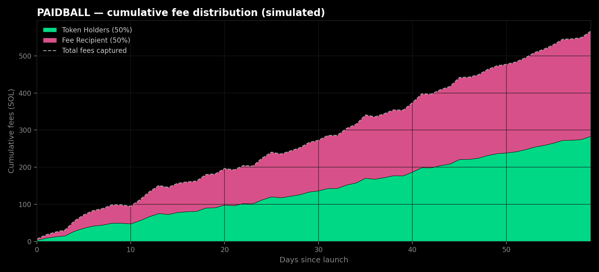

<div align="center">


# PAIDBALL

### every trade pays two sides.

**built on PAID / UsePaid infrastructure — with the fee split rewired.**

[](./docs/FEE_SPLIT.md)
[](./LICENSE)
[](./docs/SECURITY.md)
[](./contracts)

</div>

<br/>

```diff
- traditional fee-on-swap:  100% → creator / treasury
+ paidball:                  50% → holders   50% → recipient
```

<br/>

<div align="center">

</div>

<br/>

## the idea, in one breath

PAID / UsePaid lets anyone launch a token with a built-in trading fee that
flows to a chosen address. PAIDBALL takes that same fee — the one already
being generated by trading — and cuts it in half. One half streams back to
the people holding the token. The other half goes to whoever the token
designates. No new fee is added. No trading behavior changes. The only thing
that moves is where the money that was *already there* ends up.

That's it. That's the whole idea. Everything below is what it took to make
it actually work on-chain, cheaply, at any holder count, without anyone ever
having to trust a person instead of a contract.

<br/>

## watch it route a fee

<div align="center">

</div>

<br/>

## how a swap turns into two payments

<div align="center">

</div>



No step in that sequence involves a human, a queue, or an off-chain job. The
split happens inside the same transaction as the swap.

<br/>

## live, in numbers *(simulated)*

<div align="center">

<br/><br/>

</div>

Run the simulation yourself — it uses the exact integer math the Solidity
router uses, dust and all:

```bash
python3 scripts/simulate_fees.py --swaps 5000 --mean-fee 0.5
```

<br/>

## the split is a constant, not a setting

```solidity
uint256 public constant HOLDER_BPS = 5_000;     // 50.00%
uint256 public constant RECIPIENT_BPS = 5_000;  // 50.00%
uint256 public constant BPS_DENOMINATOR = 10_000;
```

There's no `setSplit()`. There's no governance vote that changes it later.
Every token that registers with a given router version keeps that router's
split for as long as it exists — see [`docs/FEE_SPLIT.md`](./docs/FEE_SPLIT.md)
for why that's the point, not a limitation.

<details>
<summary><b>see the full split path in <code>routeFee()</code></b></summary>

```solidity
function routeFee(address token, uint256 amount) external payable {
    if (amount == 0) revert ZeroAmount();
    address recipient = feeRecipient[token];
    if (recipient == address(0)) revert NotAuthorized(token, msg.sender);

    uint256 toHolders = (amount * HOLDER_BPS) / BPS_DENOMINATOR;
    uint256 toRecipient = amount - toHolders;

    if (token == address(0)) {
        if (msg.value != amount) revert NativeValueMismatch(amount, msg.value);
        vault.depositNative{value: toHolders}(token);
        _sendNative(recipient, toRecipient);
    } else {
        _safeTransferFrom(token, msg.sender, address(vault), toHolders);
        vault.notifyDeposit(token, toHolders);
        _safeTransferFrom(token, msg.sender, recipient, toRecipient);
    }

    emit FeeSplit(token, amount, toHolders, toRecipient);
}
```

Full contract: [`contracts/PaidballFeeRouter.sol`](./contracts/PaidballFeeRouter.sol)

</details>

<br/>

## why holders don't need a push payment on every swap

Sending a payout to every holder on every trade is O(holders) — it gets
slower and more expensive as the token succeeds, which is exactly backwards.
`PaidballVault` uses a single cumulative accumulator instead:

```solidity
rewardPerShare      += depositAmount * 1e18 / totalShares;
pending(holder)      = shares(holder) * (rewardPerShare - rewardDebt[holder]) / 1e18;
```

Every claim is O(1). It doesn't matter if there are 12 holders or 120,000.
Full writeup: [`docs/ARCHITECTURE.md`](./docs/ARCHITECTURE.md).

<br/>

## project structure

```
paidball/
├── contracts/
│   ├── PaidballFeeRouter.sol      ← the split, enforced
│   ├── PaidballVault.sol          ← pull-based holder accounting
│   ├── interfaces/
│   │   └── IPaidballFeeRouter.sol
│   └── mocks/
│       └── MockPaidToken.sol
├── scripts/
│   ├── deploy.ts                  ← router + vault deploy sequence
│   └── simulate_fees.py           ← integer-identical split simulator
├── test/
│   └── FeeRouter.test.ts
├── docs/
│   ├── ARCHITECTURE.md
│   ├── FEE_SPLIT.md
│   └── SECURITY.md
├── assets/                        ← every diagram in this README
├── hardhat.config.ts
└── package.json
```

<br/>

## quickstart

```bash
git clone https://github.com/paidball/paidball.git
cd paidball
npm install

npm run compile
npm test

npm run simulate -- --swaps 2000 --mean-fee 0.4
```

<br/>

## comparison

|                              | typical fee-on-swap launch | PAIDBALL |
|------------------------------|:---:|:---:|
| fee destination              | 1 address | 2, fixed at launch |
| holder upside from trading   | none | 50%, pro-rata |
| split changeable post-launch | usually, by admin | never |
| claim cost as holders grow   | rises or breaks | flat (O(1)) |
| custody at the router        | varies | none — never holds a balance |

<br/>

## status

Experimental. Not audited. The contracts in this repo are a reference
implementation of the split mechanism — read
[`docs/SECURITY.md`](./docs/SECURITY.md) before pointing real fee volume at
them.

<br/>

<div align="center">
<sub>PAIDBALL is an independent project inspired by PAID / UsePaid's fee
infrastructure. Not affiliated with or endorsed by PAID.</sub>

<br/><br/>


<sub><b>MIT licensed</b> · half of every fee, always.</sub>

</div>
